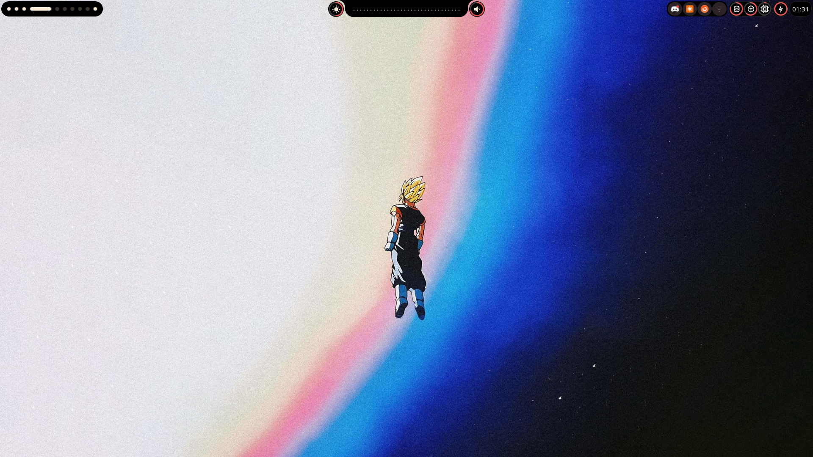

<h1 align="center">
  
  <b>ZENITH</b>
  
</h1>

A SOSS shell for <b>X11</b> and <b>i3wm</b>, crafted using [fabric](https://github.com/Fabric-Development/fabric). The designs are heavily inspired by [Ax-Shell](https://github.com/Axenide/Ax-Shell). Zenith can also be seen as a ground-up effort to create an i3wm shell with X11 support for non-Hyprland users. I've had a **LOT** of fun working with fabric and making this. I hope you do too!

**This repo is still under works and is not yet packaged for installation.** You can use it as a reference for setup :)

<div>
  <h2>Showcase</h2>
<table align="center">
  <tr>
    <td colspan="1"></td>
  </tr>
</table>
</div>

> [!NOTE]
> This repo does not contain my scripts and i3 config which integrates some keybindings to control the shell.

## Some Dependencies
- brightnessctl
- pactl
- feh
- gray
- playerctl
  - (apt) gir1.2-playerctl-2.0

## Gray installation
Zenith uses [Gray](https://github.com/Fabric-Development/gray?tab=readme-ov-file) for menu handling. Follow the installation steps in the official documentation.
Ensure you have the following dependencies installed before building:
- valac
- libdbusmenu-gtk3-dev

Clone the repo:
 ```bash
 git clone https://github.com/Fabric-Development/gray.git
 ```
